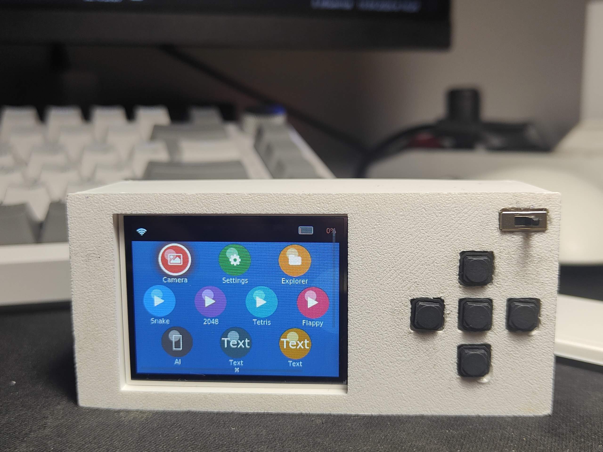
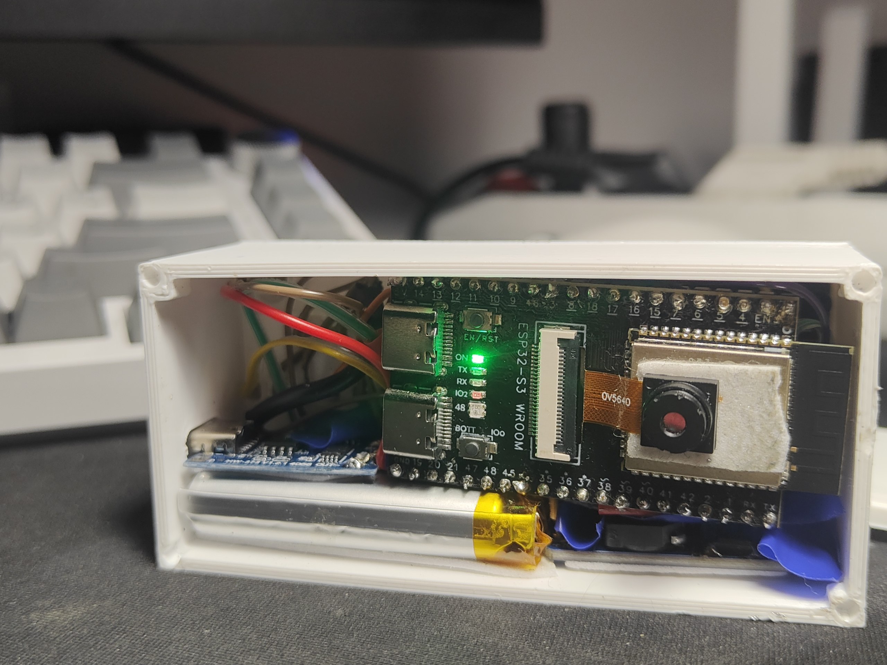

# CheatSheet2

🇷🇺 [Русский](README.md) · **English**

## About

A portable device based on the **ESP32-S3-N16R8 CAM** with a color display, a camera, and 5 control buttons

## ⚡ Features

 - Easy control from your phone with the companion app
 - Fits in a pencil case
 - Silent buttons
 - Well-readable Russian/English text
 - Lots of games (Snake, 2048, Tetris, Flappy Bird)
 - Large display
 - Camera
 - AI agent (requires a phone connection) that you can send photos to

## 🛠️ Build

### Components

| Component | Qty | Purchase link (verified in Russia) |
|-----------|:---:|-------------------------------------|
| ESP32-S3-CAM N16R8 (any camera module works; the project uses OV5640) | 1 | https://ali.click/lftxm1n |
| Any battery | 1 | https://ozon.ru/t/T2QhKQN |
| TP4056 charger module | 1 | https://ali.click/8ktxm18 |
| MT3608 boost converter | 1 | https://ali.click/9mtxm1z |
| 2.0" TFT display 320x240 ST7789 | 1 | https://ali.click/vntxm1e |
| Silent buttons | 3 | https://ali.click/fotxm1k |
| Power switch | 1 | https://ali.click/crtxm11 |
| 10 kΩ resistors | 2 | https://ali.click/f9uxm1h |

## 🔌 Wiring

| Module | Pin | Pin | Pin | Pin | Pin | Pin | Pin |
|--------|-----|-----|-----|-----|-----|-----|-----|
| **🔋 Battery** | +(red wire) → TP4056 bat + | -(black wire) → TP4056 bat - | - | - | - | - | - |
| **🔋 TP4056** | Out + → center pin of the switch + | Out - → VIN - (MT3608 boost converter) | Out + → 10 kΩ resistor → ESP GPIO0 → 10 kΩ resistor → ESP GND (-) | - | - | - | - |
| **Switch** | Right pin of the switch → VIN + (MT3608 boost converter) | - | - | - | - | - | - |
| **MT3608 (boost converter)** | VOUT(+) → ESP 5V | VOUT(-) → ESP GND | - | - | - | - | - |
| **Display** | VCC(+) → ESP32 3.3V | GND(-) → ESP32 GND | SCLK (SCL) → ESP GPIO 41 | MOSI (SDA) → ESP GPIO 42 | CS → ESP GPIO 47 | DC → ESP GPIO 46 | RST → ESP32 3.3V |
| **Buttons** (⚠️ one leg of every button → ESP GND) | Left → GPIO 14 | Right → GPIO 45 | Up → GPIO 1 | Down → GPIO 2 | OK → GPIO 21 | - | - |
