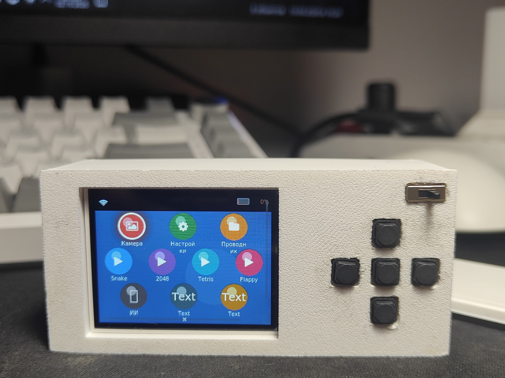

# CheatSheet2

**[English](README.en.md)** · 🇷🇺 Русский

## О проекте

Портативное устройство на **ESP32-S3-N16R8 CAM** с цветным дисплеем, камерой и 5 кнопками управления

## ⚡ Возможности

 - Удобное управление с телефона с помощью приложения
 - Помещается в пенал
 - Бесшумные кнопки
 - Хорошо читаемый русский/английский текст
 - Много игр (Змейка, 2048, тетрис, flappy bird)
 - Большой дисплей
 - Камера
 - ИИ-агент (для работы нужно подключение с телефона), которому можно отправлять фото

## 🛠️ Сборка

### Необходимые компоненты

| Компонент | Кол-во | Ссылка для покупки (проверено для РФ) |
|-----------|:------:|----------------------------------------|
| ESP32-S3-CAM N16R8 (подойдёт любая камера, в проекте OV5640) | 1 | https://ali.click/lftxm1n |
| Любой аккумулятор | 1 | https://ozon.ru/t/T2QhKQN |
| TP4056 | 1 | https://ali.click/8ktxm18 |
| Бустер напряжения MT3608 | 1 | https://ali.click/9mtxm1z |
| TFT-дисплей 2.0" 320x240 ST7789 | 1 | https://ali.click/vntxm1e |
| Бесшумные кнопки | 3 | https://ali.click/fotxm1k |
| Тумблер питания | 1 | https://ali.click/crtxm11 |
| Резистор 10 кОм | 2 | https://ali.click/f9uxm1h |

## 🔌 Схема подключения

| Модуль | Пин | Пин | Пин | Пин | Пин | Пин | Пин |
|--------|-----|-----|-----|-----|-----|-----|-----|
| **🔋 Аккумулятор** | +(красный провод) → TP4056 bat + | -(чёрный провод) → TP4056 bat - | - | - | - | - | - |
| **🔋 TP4056** | Out + → центральная ножка переключателя (свитча) + | Out - → VIN - (повышайка напряжения MT3608) | Out + → резистор 10 кОм → ESP GPIO0 → резистор 10 кОм → ESP GND (-) | - | - | - | - |
| **Выключатель** | Правая ножка переключателя → VIN + (повышайка напряжения MT3608) | - | - | - | - | - | - |
| **MT3608 (бустер напряжения)** | VOUT(+) → ESP 5V | VOUT(-) → ESP GND | - | - | - | - | - |
| **Дисплей** | VCC(+) → ESP32 3.3V | GND(-) → ESP32 GND | SCLK (SCL) → ESP GPIO 41 | MOSI (SDA) → ESP GPIO 42 | CS → ESP GPIO 47 | DC → ESP GPIO 46 | RST → ESP32 3.3V |
| **Кнопки** (⚠️ 1 ножка каждой кнопки — на ESP GND) | Левая → GPIO 14 | Правая → GPIO 45 | Верхняя → GPIO 1 | Нижняя → GPIO 2 | OK → GPIO 21 | - | - |
